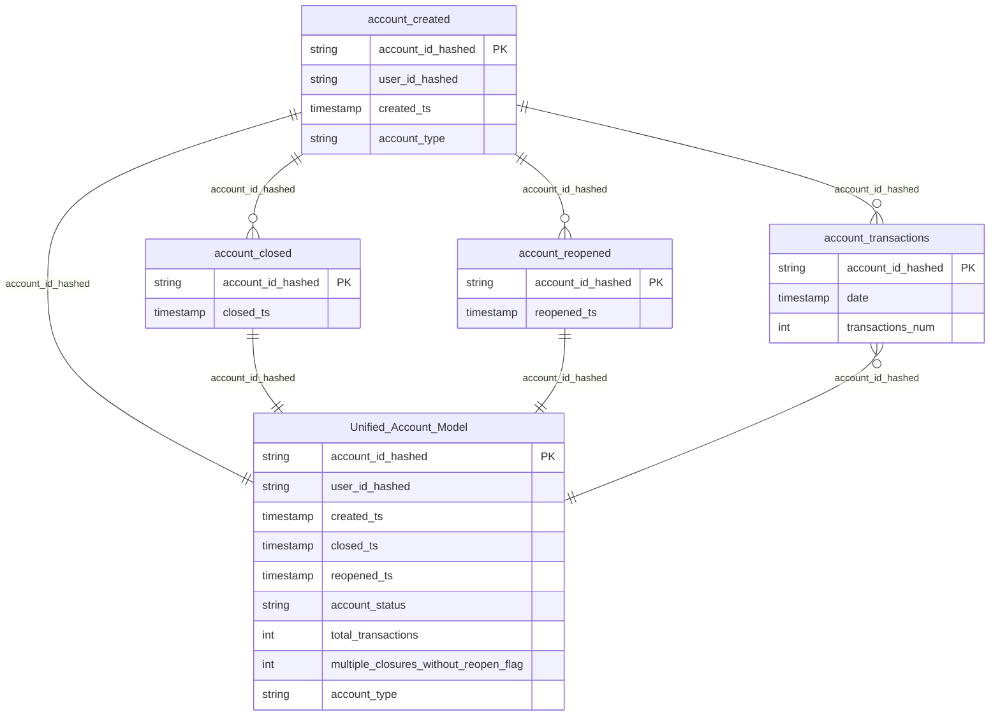

## Monzo Account Lifecycle and Transactions Data Model

# Project Overview
This project involves designing a reliable and accurate data model representing the lifecycle of Monzo accounts, including their creation, closure, reopening, and transactional data. The model provides a comprehensive view of each account and allows analysts to quickly and easily perform business analysis, ensuring historical consistency and flexibility for various use cases.

The final Unified Account Model combines lifecycle events with transaction data to deliver business-ready insights on the status of each account, while addressing data anomalies discovered during the modeling process.


### ER Diagram



# Entity Definitions:

`account_created`: Holds details on account creation. 

`account_closed`: Holds details on account closure events.

`account_reopened`: Holds details on when accounts are reopened.

`account_transactions`: Contains transaction data for each account.

`Unified_Account_Model`: Aggregates all lifecycle and transactional data to provide a single source of truth.

## Relationship Definitions
`account_created ||--o{ account_closed : account_id_hashed`:
One-to-many relationship: One account can have multiple closure events.

`account_created ||--o{ account_reopened : account_id_hashed`:
One-to-many relationship: One account can be reopened multiple times after being closed.

`account_created ||--o{ account_transactions : account_id_hashed`:
One-to-many relationship: One account can have multiple transactions over time.

`account_created ||--|| Unified_Account_Model : account_id_hashed`:
One-to-one relationship: Each account corresponds to one unified record.

`account_closed ||--|| Unified_Account_Model : account_id_hashed`:
One-to-one relationship: The latest closure event for each account is represented in the unified model.

`account_reopened ||--|| Unified_Account_Model : account_id_hashed`:
One-to-one relationship: Each reopening event is reflected in the unified model.

`account_transactions o{--|| Unified_Account_Model : account_id_hashed`:
Many-to-one relationship: Multiple transactions for each account are aggregated into a single total_transactions field in the unified model.


# Key Problem and Requirements

### Core Objectives:
`Accurate and Complete Data`: The model accurately reflects the full lifecycle of accounts, ensuring there is no duplication or data integrity issue.

`Intuitive for Analysts`: The model is designed to be easy to use, enabling flexibility in answering business questions like tracking open accounts, active users, and account activity.

`Lifecycle and Transaction Aggregation`: The model aggregates lifecycle events (creation, closure, reopening) with transaction data, allowing comprehensive analysis at the account level.

`Historically Consistent`: The model is built to correctly reflect the status of each account at any point in time.

`Handling Data Anomalies`: Issues such as multiple closure events in a short time frame without corresponding reopen events are identified and addressed during development as part of ensuring data quality.


# Issues Discovered

During the modeling process, several data integrity issues related to the account_closed table were encountered:

### Duplicate Closures: 
    Some accounts had multiple closure events with timestamps very close together (within minutes or seconds). These entries did not have corresponding reopen events, raising the possibility of data ingestion errors due to system retries or logging issues.
    
# Approach to Addressing These Issues 
To resolve these issues:

`Deduplication of Closure Events`: Closure events were deduplicated when multiple closure events occurred within 1 hour on the same day. These were assumed to be erroneous duplicate records.

`Flagging Multiple Closures Without Reopen Events`: Accounts with multiple closure events on different days (and without corresponding reopen events) were flagged for further investigation, as they may represent special cases or anomalies.

## Data Model Design
The data model was designed using normalization and aggregation techniques to ensure data integrity and analytic flexibility. It combines lifecycle and transactional data to offer a single view of each account’s status and activity.

## Fact and Dimension Tables
### Fact Table:
`Unified_Account_Model`: This is the core fact table in the data model. It aggregates lifecycle and transaction data, providing a summary of each account’s status, total transaction count, and any anomalies (such as multiple closures without reopenings). This fact table provides a business-ready view for analysts.

### Dimension Tables:

`account_created`: Describes each account, including the user who created it (user_id_hashed), the account type, and the timestamp of account creation (created_ts).

`account_closed`: Tracks the closure events for each account, storing the timestamp of account closure (closed_ts).

`account_reopened`: Holds data on accounts that were reopened after being closed, with reopened_ts indicating when the account was reopened.

`account_transactions`: Stores granular transaction data, including the date of each transaction and the number of transactions (transactions_num). This table is aggregated into total_transactions in the unified fact table.

## Key Features of the Data Model

`Lifecycle Event Aggregation`: Account creation, closure, and reopening events are brought together into a unified model, providing a clear view of each account's lifecycle.

`Transaction Data Aggregation`: Transaction data is aggregated into the total_transactions field, summarizing all transactional activity for each account.

`Deduplication of Closure Events`: To address duplicate closure events, only the latest closure event for each account was retained when multiple events occurred within 1 hour on the same day.

`Flagging Anomalies`: Accounts with multiple closure events on different days and no corresponding reopen events were flagged for further investigation. This makes it easier to spot potential anomalies in the data.

`Account Status Tracking:` The model calculates whether an account is currently open, closed, or reopened based on the most recent closure and reopening events.

`Flexible and Scalable`: The model is flexible enough to allow for future expansions, such as adding more lifecycle events or transaction data. It can also scale as more accounts and transactions are added over time.

## Key Metrics Supported by the Data Model
`Account Status Tracking`:
The account_status field in the Unified Account Model allows analysts to easily determine whether an account is currently open, closed, or reopened.

`Transaction Activity`:
The total_transactions field provides a quick way for analysts to analyze the total number of transactions per account over time, without needing to query the raw transaction data.

`Flagging Multiple Closures Without Reopen`:
Accounts that were closed multiple times without being reopened are flagged, helping to identify anomalies or unusual behaviors in the account lifecycle.

`Lifecycle Event Analysis`:
The model allows for the analysis of account lifecycle events (creation, closure, reopening) to better understand customer behavior, including retention, churn, and reactivation.


## How This Model Supports Self-Service Analysis
This data model is structured to allow self-service analysis for business users and analysts:

`Account Lifecycle Analysis`:
By combining all lifecycle events into a single model, analysts can easily track how accounts move through different stages (open, closed, reopened).

`Transaction Analysis`:
The aggregated transaction data provides a quick overview of account activity, making it easy to analyze transaction volumes by account type or account status.

`Anomaly Detection`:
The model includes a flag to highlight accounts with unusual patterns of closure and reopening, helping analysts quickly identify issues for further investigation.

`Flexible Querying`:
The model allows for flexible querying across dimensions (e.g., account type, creation date, or transaction volume) while maintaining historical consistency.


# Data Testing and Observability

### Ensuring Data Quality and Observability with Elementary and dbt Project Evaluator

Maintaining high data quality and monitoring the health of a data pipeline are critical to ensuring that downstream analyses and decisions are based on reliable information. In this project, Elementary and dbt Project Evaluator can used to implement data testing and provide robust data observability across the pipeline.

key tests in data transformation

## Data Integrity Test for Account Lifecycle Events
`Purpose`: Ensure that there is a correct alignment of lifecycle events (account creation, closure, reopening) and that no invalid relationships exist.

`Check`: For every account in the Unified_Account_Model, the created_ts must be earlier than or equal to closed_ts (if present), and closed_ts must be earlier than reopened_ts (if present).

`Why`: This test ensures that accounts follow a logical lifecycle sequence: accounts should not be closed before they are created or reopened before they are closed.

##### SQL 
```
SELECT account_id_hashed
FROM Unified_Account_Model
WHERE (closed_ts < created_ts OR reopened_ts < closed_ts)

```
`Expected Result`: No rows should be returned. If rows are returned, it indicates invalid lifecycle sequences.

## Transaction Consistency Test
`Purpose`: Ensure that the total_transactions field in the Unified_Account_Model accurately reflects the total transactions recorded in the account_transactions table.

`Check`: The total_transactions field in the Unified_Account_Model must match the sum of transactions from the account_transactions table for each account.

`Why`: This test guarantees that transaction data has been correctly aggregated and reflects actual account activity.

##### SQL
```
SELECT uam.account_id_hashed, uam.total_transactions, 
       SUM(at.transactions_num) AS expected_total
FROM Unified_Account_Model uam
JOIN account_transactions at ON uam.account_id_hashed = at.account_id_hashed
GROUP BY uam.account_id_hashed
HAVING uam.total_transactions != expected_total;

```

## Schema Change Test
To ensure that the data model remains robust despite changes in upstream tables, dbt’s schema tests can be implemented. These tests validate the structure of the source tables and help catch any unexpected changes in schema that could break downstream transformations.

### Key schema tests include:

`Not Null Test`: Ensures critical columns like account_id_hashed, user_id_hashed, and created_ts are always populated and not null.

`Unique Test`: Validates that the combination of account_id_hashed and user_id field is unique, ensuring that no two user_id  share the same account_id_hashed unless expected from business feature.

`Dbt expectation`: expect that each columns in source tables used in downstream model transformation are present

`Relationships Test`: Verifies that  relationships, such as account_id_hashed linking to related tables are intact. An account_id_hashed in the account_closed table should also be present in the account_open table


